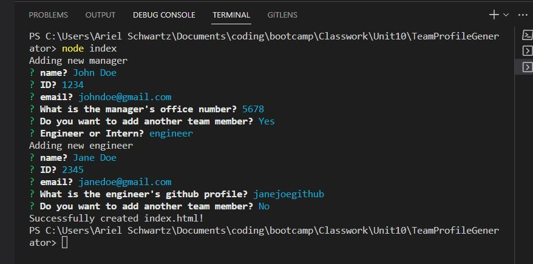

# Team Profile Generator 

## Description:

This command-line application allows users to easily generate a team roster by inputting information about their team members. The code validates user input using the Joi module to ensure that the input is valid and formatted correctly. Once the information is provided, an HTML file is automatically generated, displaying the team roster in a nicely formatted way. By clicking on an email address, users can open their default email program and populate the TO field with the email address. Clicking on a GitHub username opens the respective profile in a new tab.

## User Story

&nbsp; AS A manager
I WANT to generate a webpage that displays my team's basic info
SO THAT I have quick access to their emails and GitHub profiles

&nbsp;

## Table of Contents:

- [Installation](#installation)
- [Usage](#usage)
- [Tests](#tests)
- [Badges](#badges)
- [How_to_Contribute](#how_to_contribute)
- [Questions](#questions)
- [License](#license)

## Installation:

&nbsp; node modules will install automatically

## Usage:

&nbsp; The repo can be found at: https://github.com/arishorts/TeamProfileGenerator  
&nbsp; A demo can be found at: https://youtu.be/AnY1dJIekd0

The application prompts users to enter their team manager's name, employee ID, email address, and office number. After providing this information, a menu is presented with the option to add an engineer or an intern, or to finish building the team. Selecting the engineer option prompts the user to input the engineer's name, ID, email, and GitHub username, and then takes them back to the menu. Similarly, selecting the intern option prompts the user to enter the intern's name, ID, email, and school, before returning them to the menu.

Once the user decides to finish building the team, the application exits and generates the HTML file with the complete team roster. Overall, this application streamlines the process of creating a team roster, making it simple and intuitive.

## Tests:

&nbsp; Testing implemented with Jest

## Badges:

## How_to_Contribute:

&nbsp; If you would like to contribute, refer to the [Contributor Covenant](https://www.contributor-covenant.org/)

## Questions:

&nbsp; My GitHub profile can be found at: https://github.com/arishorts
 &nbsp; Reach me with additional questions at : arieljschwartz@gmail.com

## License:

&nbsp; http://choosealicense.com/licenses/mit/

---

© 2022 Ariel Schwartz LLC. Confidential and Proprietary. All Rights Reserved.
